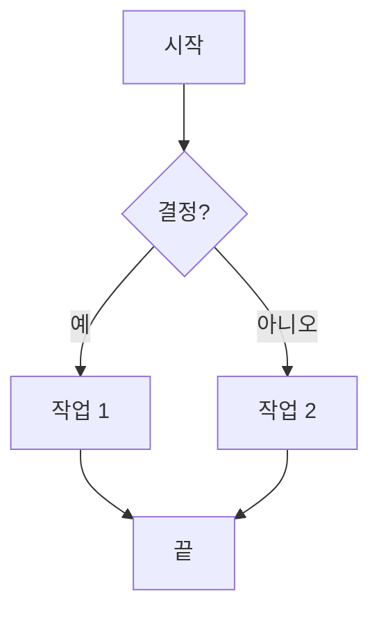
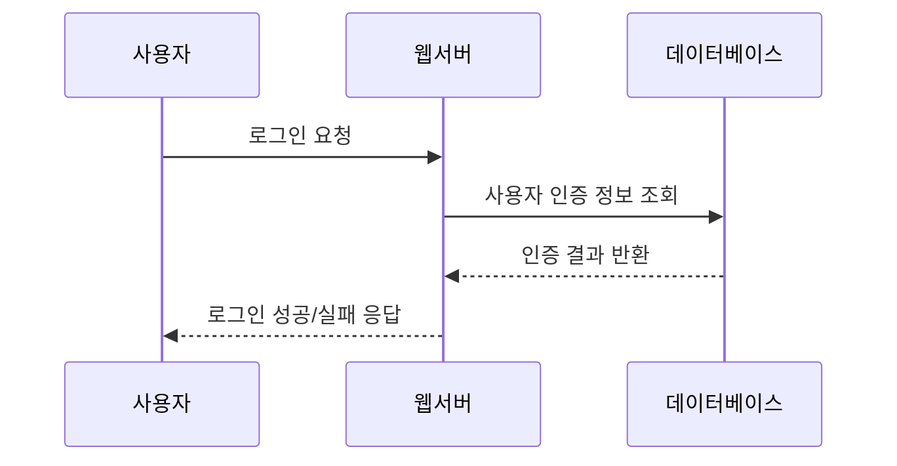
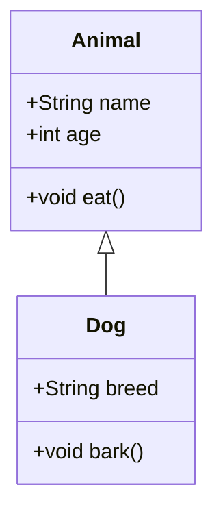
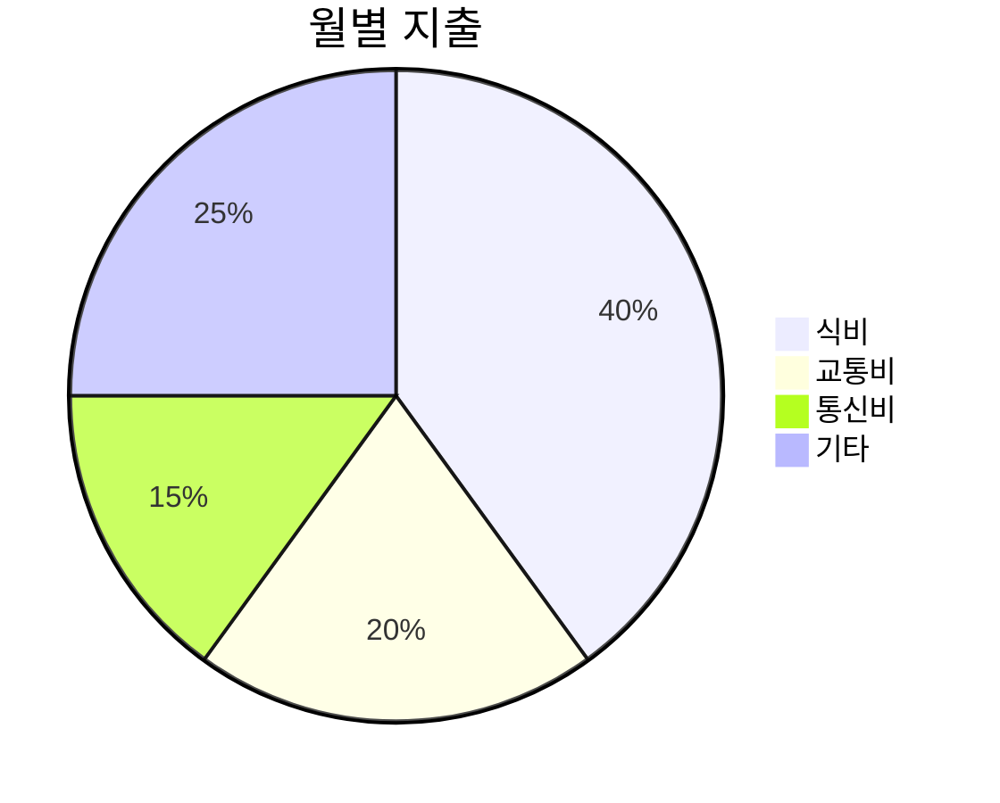

# Mermaid 다이어그램: 텍스트로 그리는 시각화

Mermaid는 JavaScript 기반의 다이어그램 및 차트 도구로, 마크다운(Markdown)과 유사한 텍스트 기반 구문을 사용하여 다이어그램을 생성할 수 있게 해줍니다. "코드로서의 다이어그램(Diagrams as Code)" 접근 방식을 통해 복잡한 다이어그램을 쉽게 유지 관리하고 개발 워크플로우에 통합할 수 있습니다.

## 1. Mermaid 작동 방식 및 장점

Mermaid는 엔티티와 관계에 대한 텍스트 선언을 다이어그램으로 변환합니다. 일반적으로 Mermaid 코드는 마크다운 코드 블록 내에 `mermaid` 키워드와 함께 작성됩니다 (예: ````mermaid ... ````).

### 주요 특징 및 장점:

*   **텍스트 기반**: 간단한 텍스트 정의로 다이어그램을 생성합니다.
*   **버전 관리 친화적**: 다이어그램을 코드와 함께 저장하고 버전 관리할 수 있습니다.
*   **자동화**: 수동으로 드래그 앤 드롭할 필요 없이 코드를 통해 다이어그램을 자동으로 생성합니다.
*   **다양한 다이어그램 유형**: 플로우차트, 시퀀스 다이어그램, 클래스 다이어그램, ERD, 간트 차트, 파이 차트, 마인드맵 등 다양한 유형을 지원합니다.
*   **통합**: Mermaid Live Editor, VS Code 플러그인, GitHub Markdown 등 다양한 도구 및 플랫폼과 통합됩니다.

## 2. Mermaid 다이어그램 유형 및 기본 문법

모든 Mermaid 다이어그램은 다이어그램 유형 선언으로 시작합니다 (예: `graph TD`는 상단에서 하단으로 흐르는 플로우차트).

### 2.1. 플로우차트 (Flowchart)

가장 기본적인 다이어그램 유형으로, 프로세스 흐름을 시각화합니다.



### 2.2. 시퀀스 다이어그램 (Sequence Diagram)

객체 간의 메시지 교환 순서를 보여줍니다.



### 2.3. 클래스 다이어그램 (Class Diagram)

객체 지향 시스템의 클래스, 속성, 메서드 및 관계를 나타냅니다.



### 2.4. 파이 차트 (Pie Chart)

데이터의 비율을 시각화합니다.



## 3. 시작하기 및 학습 자료

*   **Mermaid Live Editor**: 온라인에서 Mermaid 코드를 실시간으로 작성하고 미리 볼 수 있는 가장 좋은 도구입니다. [https://mermaid.live/](https://mermaid.live/)
*   **공식 문서**: Mermaid 웹사이트에서 각 다이어그램 유형에 대한 자세한 문법을 확인할 수 있습니다. [https://mermaid.js.org/](https://mermaid.js.org/)
*   **온라인 튜토리얼**: freeCodeCamp 등 다양한 웹사이트에서 Mermaid 튜토리얼과 실용적인 예시를 제공합니다.

---

Mermaid는 복잡한 아이디어를 빠르고 효율적으로 시각화하는 데 매우 유용한 도구입니다. 텍스트 기반이므로 코드와 함께 버전 관리하기 용이하며, 개발 문서화에 큰 이점을 제공합니다.
